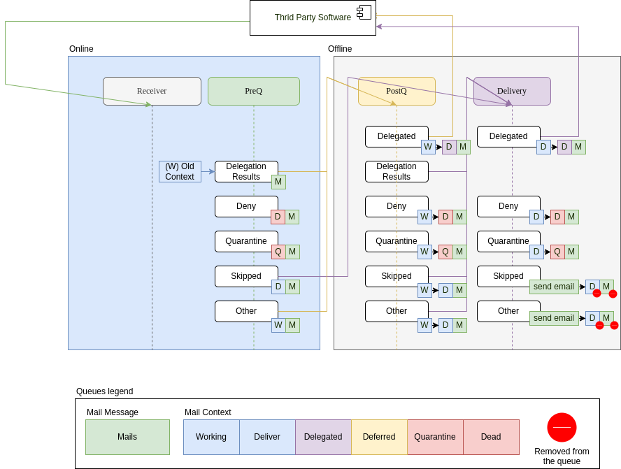

# Queue System

Queues are active in `postq` & `delivery` stages.
Here is a schema of how messages are transferred between queues, following the rule engine results once a stage has been evaluated.

