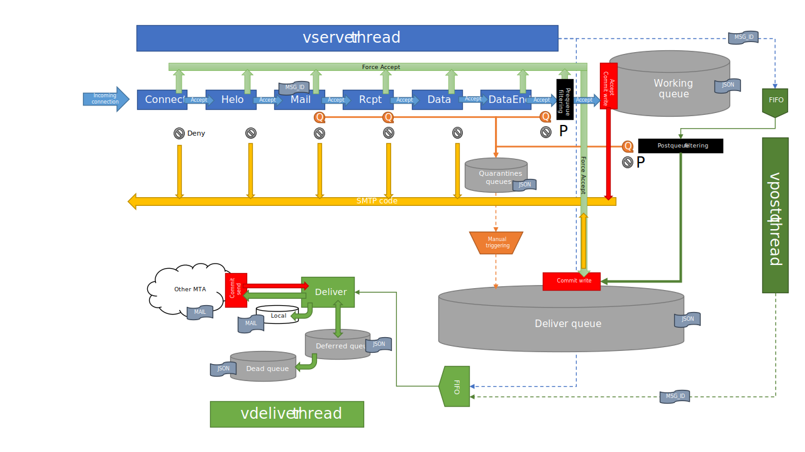

## vSMTP architecture

vSMTP is based on an multi-threaded architecture. Threads are communicating through asynchronous channels.

At startup, vSMTP creates the channels and spawns threads : `vserver`, `vpostq` and `vdelivery`.

The `vserver` thread binds to the interfaces defined in the configuration file and waits for an incoming connection (infinite loop). The `vpost` and `vdeliver` initial threads are listening on their channel for an incoming message.

As soon as a connection is accepted, `vserver` spawns a `vsmtp` thread to handle the SMTP transaction. The `vsmtp` thread is responsible for the SMTP transaction, walking through the SMTP states and sending SMTP return codes. It also takes care of the internal routing of the mail:

- If the mail is rejected or quarantined, `vsmtp` write it in the right queue.
- If a FACCEPT is detected, `vsmtp` write the mail in the deliver queue and send a message in the `vdeliver` channel.
- Otherwise, `vsmtp` write the mail in the working queue and send a message in the postq channel .

> There is one `vsmtp` thread per connection. At a given moment there can be N `vsmtp` threads for N connections.

At the end of the transaction or following a DENY rule, the `vsmtp` thread loses the connection and frees itself.

New `vpost`and `vdeliver` threads are spawned by their parent when a message is received in their channel :

- The `vpost` thread takes care of the "post queuing" processing. It is responsible for sending mails to the right queue (deliver or quarantine) or deleting them, then freeing himself. If the mail is considered as deliverable, it sends a message in the deliver channel.

- The `vdeliver` thread has the responsibility of the delivery.

---

TO DO : cron mechanism for the delivery subsystem
